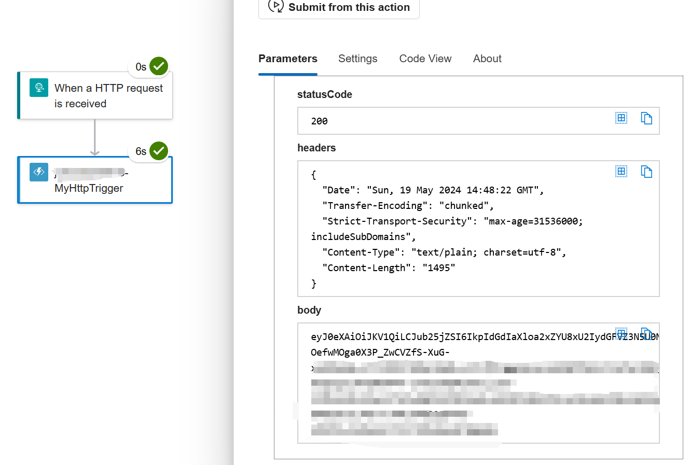

# Azure Function Oauth 2.0 Code Grant

This document is a step-by-step guide for developing an Azure Function that can
get an access token from the Microsoft identity platform using a certificate
stored in Key Vault.

[Endpoint for getting the access token](https://learn.microsoft.com/en-us/entra/identity-platform/v2-oauth2-client-creds-grant-flow#second-case-access-token-request-with-a-certificate)

## Prerequisites

- [Azure Subscription](https://azure.microsoft.com/en-us/get-started/azure-portal)
- [Azure Key Vault with a certificate](https://learn.microsoft.com/en-us/azure/key-vault/general/quick-create-portal)
  - [Add a certificate](https://learn.microsoft.com/en-us/azure/key-vault/certificates/quick-create-portal#add-a-certificate-to-key-vault)
- [Register an application on Entra ID](https://learn.microsoft.com/en-us/entra/identity-platform/quickstart-register-app)
- [Azure Functions Core Tools](https://github.com/Azure/azure-functions-core-tools/blob/v4.x/README.md#windows)
- [Azure CLI](https://learn.microsoft.com/en-us/cli/azure/install-azure-cli)
- [.NET](https://dotnet.microsoft.com/en-us/)

This guide focuses on Azure Functions Core Tools. There are other development
environments like
[Visual Studio Code](https://learn.microsoft.com/en-us/azure/azure-functions/functions-develop-vs-code?tabs=node-v4%2Cpython-v2%2Cisolated-process&pivots=programming-language-csharp)
and
[Visual Studio](https://learn.microsoft.com/en-us/azure/azure-functions/functions-develop-vs?pivots=isolated).

## Configure certification authorities for the application on Entra ID

Go to the application registered on Entra ID, upload the certificate stored in
your Key Vault.


## Develop Azure Function in local environment

### Create a local Azure Functions project

```pwsh
func init MyProjFolder --worker-runtime dotnet-isolated
```

This command creates Function project named `MyProjFolder`.

### Create a function with an HTTP trigger

```pwsh
func new --template "Http Trigger" --name MyHttpTrigger
```

This command creates a `MyHttpTrigger.cs` file which contains the template
function. We will modify this function to a token acquisition function later.

### Start the Function runtime

```pwsh
func start
```

When the runtime starts successfully, it outputs a list of functions in the
project, including the URLs of any HTTP-triggered like this:

```
Functions:
        MyHttpTrigger: [GET,POST] http://localhost:7071/api/MyHttpTrigger
```

Now we can send an request to the function endpoint and see output like this:


### Develop a token acquisition function

Before writing the function, we need to collect the following information on
Azure:

- Key Vault URI
- Certificate name
- Client ID
- Tenant ID

Open the file `MyHttpTrigger.cs` and replace the existing content with the code
below. We also need to provide the value of these four variables `KeyVaultURI`,
`certificateName`, `clientId`, `tenantId`.

```csharp
using Microsoft.Azure.Functions.Worker;
using Microsoft.Extensions.Logging;
using Microsoft.AspNetCore.Http;
using Microsoft.AspNetCore.Mvc;
using Microsoft.Identity.Client;
using System.Security.Cryptography.X509Certificates;
using Azure.Security.KeyVault.Secrets;
using Azure.Identity;

namespace GetAccessTokenDemo
{
    public class MyHttpTrigger
    {
        private readonly ILogger<MyHttpTrigger> _logger;

        public MyHttpTrigger(ILogger<MyHttpTrigger> logger)
        {
            _logger = logger;
        }

        [Function("MyHttpTrigger")]
        public async Task<IActionResult> Run([HttpTrigger(AuthorizationLevel.Anonymous, "get")] HttpRequest req)
        {
            _logger.LogInformation("C# HTTP trigger function processed a request.");

            string KeyVaultURI = "<Key Vault URI>";
            string certificateName = "<Certificate Name>";

            SecretClient kvClient = new SecretClient(new Uri(KeyVaultURI), new DefaultAzureCredential());
            KeyVaultSecret secret = await kvClient.GetSecretAsync(certificateName);

            
            string clientId = "<Client ID>";
            string tenantId = "<Tenant ID>";
            
            string authority = $"https://login.microsoftonline.com/{tenantId}";
            string scope = "https://graph.microsoft.com/.default";
            
            byte[] certificateByte =  Convert.FromBase64String(secret.Value);
            X509Certificate2 certificate = new X509Certificate2(certificateByte,
            string.Empty, X509KeyStorageFlags.MachineKeySet | X509KeyStorageFlags.PersistKeySet | X509KeyStorageFlags.Exportable);

            IConfidentialClientApplication app = ConfidentialClientApplicationBuilder.Create(clientId)                
                .WithCertificate(certificate)
                .WithAuthority(authority)
                .Build();

            var authResult = await app.AcquireTokenForClient(new[] { scope })
                                .ExecuteAsync()
                                .ConfigureAwait(false);

            return new OkObjectResult(authResult.AccessToken);
        }
    }
}
```

Install the packages we import lately.

```pwsh
dotnet add package Azure.Identity
dotnet add Azure.Security.KeyVault.Secrets
```

Sign into Azure with Azure CLI. We need to sign in Azure for getting access to
the Key Vault. Note that the account should have enough permission to access the
Key Vault.

```
az login
```

Start the function runtime.

```pwsh
func start
```

Trigger the function and the access code will be returned in the body.


## Publish to Azure

### Create a Azure Function resrouce

Select .NET for runtime.


### Assign Key Vault Secrets User

Function app needs **Key Vault Secrets User** Role to access Key Vault.

### Add Authentication to Function App

After the Function App is created, it is **publicly accessible**. Since our
Function returns access token which we don't want to expose, we should add
authentication to the Function. We use **Managed Identity** for this example.
There are two types of Managed Identity, system-assigned and user-assigned
identity. Follow the tutorials below if you don't know how to create a managed
identity.

- [Enable system-assigned identity](https://learn.microsoft.com/en-us/azure/logic-apps/authenticate-with-managed-identity?tabs=consumption#enable-system-assigned-identity-in-the-azure-portal)

- [Add user-assigned identity](https://learn.microsoft.com/en-us/azure/logic-apps/authenticate-with-managed-identity?tabs=consumption#add-user-assigned-identity-to-logic-app-in-the-azure-portal)

#### Get Object (principal) ID of Managed Identity

- **System Assigned**

Copy the identity's Object (principal) ID


- **User Assigned**

Copy the identity's Object (principal) ID


#### Configure Function authentication

Click **Add identity provider**.


- Application (client) ID field: Object (principal) ID we got from the last
  step.
- Allowed token audiences: https://management.azure.com


### Deploy local Function project to Azure

Replace Function-APP-Name with yours.

```pwsh
func azure functionapp publish <Function-APP-Name>
```

When deployment finishs, it will output the URL to the Function like this:

```
[2024-05-19T12:21:16.193Z] Syncing triggers...
Functions in <Function-APP-Name>:
    MyHttpTrigger - [httpTrigger]
        Invoke url: https://<Function-APP-Name>.azurewebsites.net/api/myhttptrigger
```

If we open this URL in the browser, we will get **401 Unauthorized**, because
only the resource that is attached to the managed identity can access this
endpoint.

## Use Logic App with Managed Identity to test the endpoint

- Add a "Choose an Azure Function" action


- Select the Function App resource


- Configure the action

  - Method Get
  - Choose the Managed Identity we use for Function App authentication


- Run the workflow

Access token was successfully returned in the output body.


